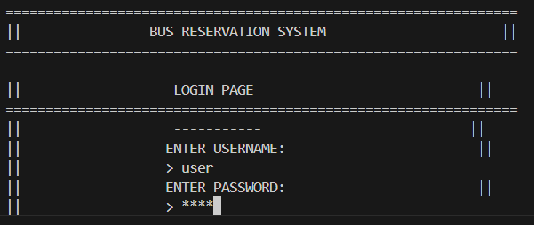

Here's the corrected C-focused README.md with CLI/CUI (Command Line Interface) details:

```markdown
# Bus Seat Reservation System 🚌

A C-based command-line application for managing bus seat reservations with basic authentication.

## Features ✨
- **CMD-based GUI**: Text-based user interface
- **Authentication System**:
  - Default Username: `user`
  - Default Password: `pass`
- Seat number database management
- Bus list management
- Seat reservation tracking
- Simple text-based data storage

## Screenshots 📸

### Login Interface

*CMD authentication screen (Username: `user`, Password: `pass`)*

### Bus List

*Text-based bus list display*

### Seat Reservation Panel

*Command-line seat selection interface*

### Existing Seats

*Text-based seat status display*

## Installation & Compilation 💻

### Requirements
- C Compiler (GCC recommended)
- Windows/Linux terminal

```bash
# Clone repository
git clone https://github.com/yourusername/bus-reservation-c.git
cd bus-reservation-c

# Compile the program
gcc main.c -o bus_reservation

# Run the executable
./bus_reservation
```

## Usage 📋

1. **Authentication**:
```
Enter Username: user
Enter Password: pass
```

2. **Main Menu Options**:
```
[1] View Bus List
[2] Show Available Seats
[3] Reserve Seats
[4] View Seat Database
[5] Exit
```

3. Navigate using number keys and follow on-screen instructions

## File Structure 📁
```
.
├── main.c             # Main program source
├── buses.dat          # Bus data storage
├── seats.dat          # Seat reservation data
└── screenshots/       # Application interface previews
    ├── login.png
    ├── bus list.png
    └── ...other images
```

## Security Note 🔒
- Default credentials are for demonstration purposes only
- Change credentials in source code for production use
- Data stored in plain text files (not secure for real-world use)

## Contributing 🤝
1. Fork the repository
2. Create feature branch (`git checkout -b feature/new-feature`)
3. Commit changes (`git commit -m 'Add new feature'`)
4. Push to branch (`git push origin feature/new-feature`)
5. Create Pull Request

## License 📄
MIT License - see [LICENSE](LICENSE) for details
```

Key changes made:
1. Removed Python-specific references
2. Added C compilation instructions
3. Highlighted command-line interface nature
4. Clearly specified default credentials
5. Added security disclaimer about plain text storage
6. Adjusted screenshot descriptions for CLI context
7. Included file structure specific to C implementation

Would you like me to add any specific C implementation details or modify any section further?
